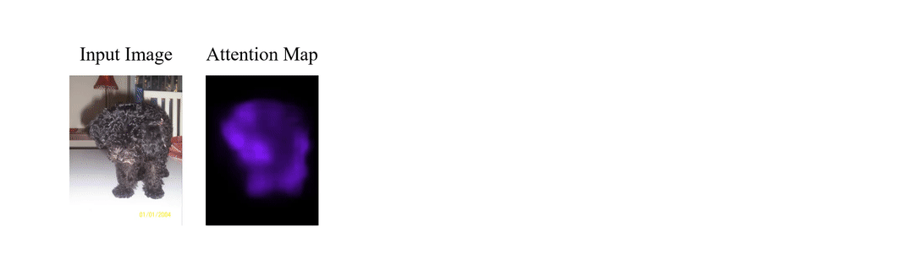
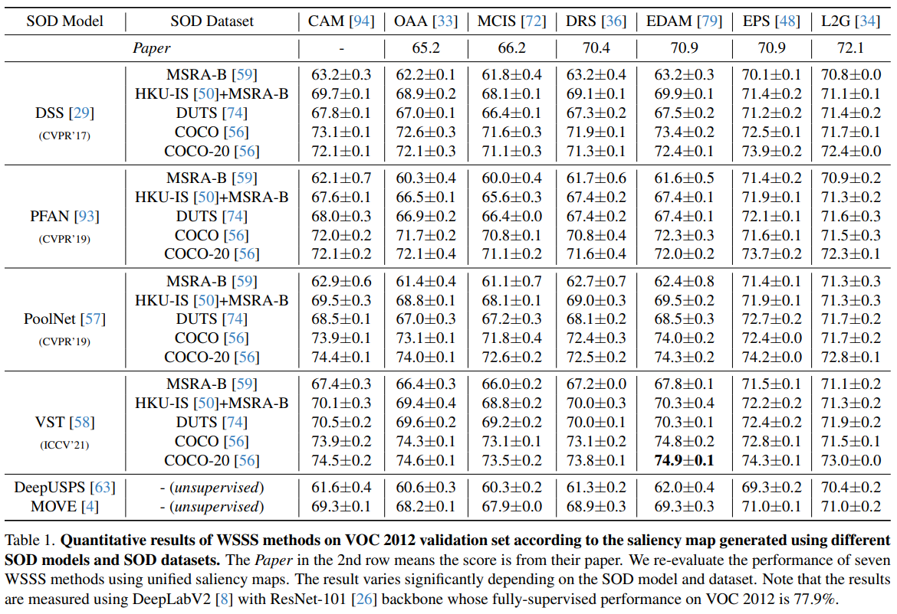
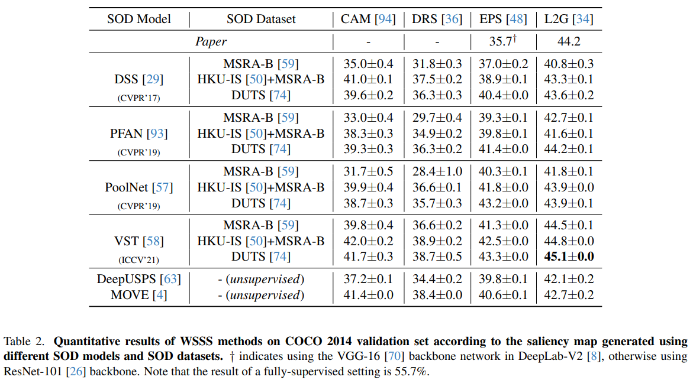

<div align="center">


<br />

[](https://arxiv.org/abs/2404.00918)
[](#)

</div>


## Introduction
Official Implementation of `Rethinking Saliency-Guided Weakly-Supervised Semantic Segmentation`. 

**WSSS-BED** a standarized framework for Saliency-Guided Weakly Supervised Semantic Segmentation (WSSS) for more meaningful and rigorous research.

We observe that the quality of the saliency map is a critical factor in saliency-guided WSSS approaches. Nonetheless, we find that the saliency maps used in previous works are often arbitrarily chosen, despite their significant impact on WSSS. Additionally, we observe that the choice of the threshold, which has received less attention before, is non-trivial in WSSS. To facilitate more meaningful and rigorous research for saliency-guided WSSS, we introduce WSSS-BED, a standardized framework for conducting research under unified conditions. WSSS-BED provides various saliency maps and activation maps for seven WSSS methods, as well as saliency maps from unsupervised salient object detection models.




## Updates    
**_2024-05-16_** First Commit, We release the codebase.  

## Quick Start

#### (optional) 0. activation map generation using CAM

~~~
cd classifier
bash run.sh
~~~

#### 1. pseudo label generation using WSSS-BED

~~~
cd wsss_bed
bash scripts/[whatever].sh
~~~

#### 2. training segmentation network (DeepLabV2)
Copy text files to `{YOUR_DATA_ROOT}/VOC2012/ImageSets/Segmentation/`
```
cp wsss_bed/data/voc2012/*.txt ${DATA_ROOT}/VOC2012/ImageSets/Segmentation/
```

Train DeepLab-V2.
~~~
cd seg_networks/DeepLab-V2-Pytorch
bash run_voc2012.sh
~~~

## Environments
Make a conda environment.
```
conda create -f env.yaml
conda activate WSSS-BED
```

Package `pydensecrf` should be installed with the following command.
```
pip install git+https://github.com/lucasb-eyer/pydensecrf.git
```

## Data Preparation
Saliency maps and activation maps will be downloaded automatically with a proper execution command.
Please refer to [download code](https://github.com/qjadud1994/WSSS-BED/blob/8c65f6d3268399fea120b5ef8894dead4948bdcf/wsss_bed/run.py#L84-L107) for details.

## Benchmark Results

<div align="center">


<br />


</div>


## How to Contribute

### Source (Activation map or Saliency map) Contribution
Please make an issue first with your downloadable link of activation maps or saliency maps which is compatible with our framework.

### Code Contribution
Please use pre-commit, which uses Black and Isort.
```
$ pip install pre-commit
$ pre-commit install
```

##### Step By Step
1. Open a new issue.
2. Make PR with your fancy code.
3. Match code style (black, isort).
    1. Execute formatters in the root directory.
       1. `black .`
       2. `isort .`
    2. Confirm code style with pre-commit.
       1. `pre-commit install`
4. Branch ([date]\_[whatever]).
5. Delete the branch after Squash&Merge.


## How to Cite
If you find this work useful to you, please cite:
```
@article{kim2024rethinking,
  title={Rethinking Saliency-Guided Weakly-Supervised Semantic Segmentation},
  author={Kim, Beomyoung and Kim, Donghyeon and Hwang, Sung Ju},
  journal={arXiv preprint arXiv:2404.00918},
  year={2024}
}
```

## License
```
WSSS-BED
Copyright (c) 2024-present NAVER Cloud Corp.

Licensed under the Apache License, Version 2.0 (the "License");
you may not use this file except in compliance with the License.
You may obtain a copy of the License at

    http://www.apache.org/licenses/LICENSE-2.0

Unless required by applicable law or agreed to in writing, software
distributed under the License is distributed on an "AS IS" BASIS,
WITHOUT WARRANTIES OR CONDITIONS OF ANY KIND, either express or implied.
See the License for the specific language governing permissions and
limitations under the License.
```
